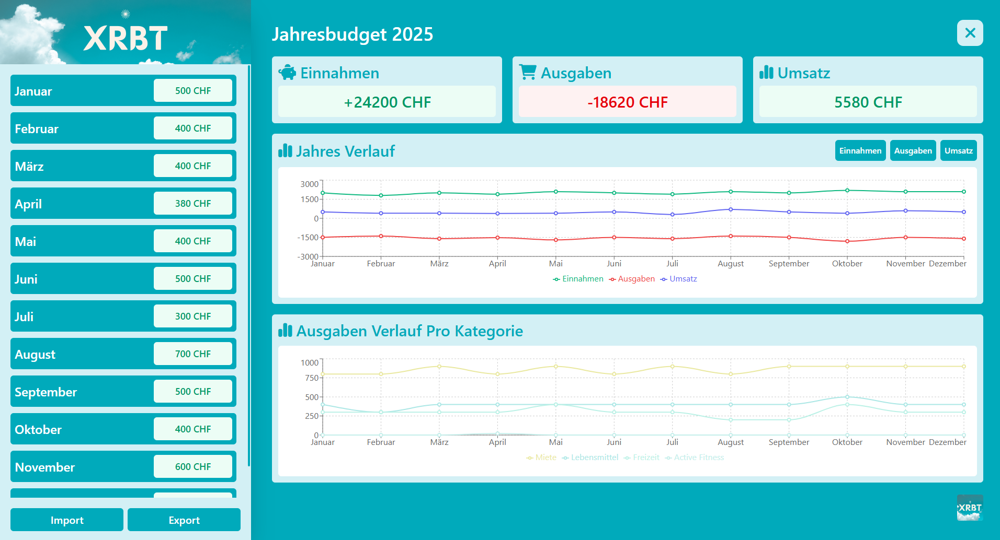

# Wilkommen beim React Budget Tracker!
Ein einfacher Budget-Tracker mit grossem Funktionsumfang, der sich durch eine einfache Gestaltung und gut einsehbare Statistiken auszeichnet. Ausserdem ist ein Export der Daten in Excel möglich.


---

## Inhaltsverzeichnis
- [Wilkommen beim React Budget Tracker!](#wilkommen-beim-react-budget-tracker)
  - [Inhaltsverzeichnis](#inhaltsverzeichnis)
  - [Installation](#installation)
  - [Features](#features)
  - [Design](#design)
  - [Technologien](#technologien)
  - [Projekt Kanban](#projekt-kanban)
  - [Lizenz](#lizenz)
  - [Kontakt](#kontakt)

---

## Installation
1. Repository klonen
```bash
git clone https://github.com/xxxCam900xxx/XRBT-Track.git
cd path/to/repo
```
2. Laden Sie [Docker Desktop](https://www.docker.com/products/docker-desktop/) herunter
3. [Docker Container starten](./docker/README.md)
```bash
docker compose -f .\compose.app.yaml up
```

---

## Features
Alle Feature und Konzepte findest du hier:
- [Klicken Sie hier, um mehr zu erfahren](/concept/README.md)

---

## Design
Genauere Informationen zum kompletten Design findest du hier:
- [Klicken Sie hier, um mehr zu erfahren](https://embed.figma.com/design/3pk8y0QeCmWFo15dD79rdp/React-Buget-Tracker?node-id=0-1&embed-host=share)



---

## Technologien

- 
- 
- 
- 
- 
- 

---

## Projekt Kanban
Für Projektmitarbeitende findest du hier das Issue Board des Projekts:
- [Klicken Sie hier, um mehr zu erfahren](https://github.com/users/xxxCam900xxx/projects/9)

---

## Lizenz

Dieses Projekt ist lizenziert unter der selbst definierten Lizenz – siehe [LICENSE](LICENSE) Datei für Details.

---

## Kontakt

Bei Fragen oder Anregungen:

- GitHub: [xxxCam900xxx](https://github.com/xxxCam900xxx)  

---

[](https://github.com/xxxCam900xxx/XRBT-Track/stargazers) [](https://github.com/xxxCam900xxx/XRBT-Track/network)