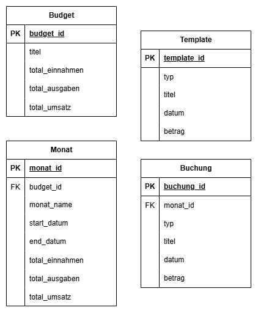

# Database Structure
Diese Datenbank dient der Verwaltung von Budgets mit zugehörigen Monaten, Buchungen und Vorlagen.

## 📄 v0 - First Look
### Enthaltene Tabellen:
- Budget: Gesamtrahmen für Einnahmen/Ausgaben.
- Monat: Zeitlich unterteilte Abschnitte pro Budget.
- Buchung: Einzelne Einnahmen oder Ausgaben pro Monat.
- Template: Vorlagen für wiederkehrende Buchungen.

### Features:
- Automatische Umsatzberechnung (total_umsatz)
- Klare Relationen über Fremdschlüssel
- Validierung von Buchungstypen (Einnahme, Ausgabe)
- Normalisierung bis zur 3. Normalform (3NF)
- ON DELETE CASCADE für automatische Löschkaskaden

