# Wilkommen bei der XRBT Dokumentation!

Schön dich hier zu sehen! Diese Dokumentation ist wie ein Handbuch für die Applikation. Ich habe hier alles wichtige aufgeschrieben was Sie wissen müssen. 

***Wie kann man ihnen behilflich sein?***

---

## Inhaltsverzeichnis
- [Wilkommen bei der XRBT Dokumentation!](#wilkommen-bei-der-xrbt-dokumentation)
  - [Inhaltsverzeichnis](#inhaltsverzeichnis)
  - [Übersicht](#übersicht)
  - [Wie starte ich das Programm?](#wie-starte-ich-das-programm)
    - [Als Benutzer starten](#als-benutzer-starten)
    - [Als Developer starten](#als-developer-starten)
  - [Wie erstelle ich ein Budget?](#wie-erstelle-ich-ein-budget)
  - [Wie lösche ich ein Budget?](#wie-lösche-ich-ein-budget)
  - [Wie erstelle ich eine Buchung?](#wie-erstelle-ich-eine-buchung)
  - [Wie speichere ich bestehende Buchungen ab?](#wie-speichere-ich-bestehende-buchungen-ab)
  - [Wie bearbeite ich eine Buchung?](#wie-bearbeite-ich-eine-buchung)
  - [Wie lösche ich eine Buchung?](#wie-lösche-ich-eine-buchung)
  - [Wann werden Backups erstellt?](#wann-werden-backups-erstellt)
  - [Wie funktioniert die Import-Funktion?](#wie-funktioniert-die-import-funktion)
  - [Wie funktioniert die Export-Funktion?](#wie-funktioniert-die-export-funktion)
  - [OverallView Statistiken](#overallview-statistiken)
  - [BudgetView Statistiken](#budgetview-statistiken)
  - [MonthView Statistiken](#monthview-statistiken)

## Übersicht
Wie sie schon Wissen ist dies ein einfacher Budget-Tracker, welchen ihnnen hilf ihr Budget für das Jahr einzutragen. Sie können Einnahmen und Ausgaben eintragen und einsehen wie sich das über die Monate / Jahre verläuft.

**Wichitg zu Wissen ist:**
- Sie starten immer auf der [OverallView](#overallview-statistiken)
- Wenn Sie ein Budget erstellt haben und das anklicken kommen Sie auf die [BudgetView](#budgetview-statistiken)
- Innerhalb der BudgetView sehen Sie alle 12 Monate. Sie können Alle 12 Monate anklicken und werden auf die [MonthView](#monthview-statistiken) weitergeleitet.
- In der MonthView können Sie alle Buchungen die Sie in diesem Monat gemacht haben eingeben.
- Alle Änderungen sehen Sie direkt Live und in den Statisiken!

## Wie starte ich das Programm?
Es gibt hier kurz gesagt 2 bis 3 Möglichkeiten wie man das Programm starten kann. Ich werde euch nur die ersten 2 Zeigen, da die 3te Variante sehr experimentiv ist.

### Als Benutzer starten
Wenn Sie das Projekt benutzen und sehr wenig bis keine Ahnung vom Programmieren haben, können Sie wie folgt vorgehen:

1. Laden Sie sich [Docker Desktop](https://www.docker.com/products/docker-desktop/) herunter
2. Laden Sie sich [Git](https://git-scm.com/downloads) herunter
3. Klonen Sie das Projekt mit Git Bash.
4. Öffnen Sie den Ordner und erstellen Sie eine Verknüpfung mit dem ``Launcher.exe`` oder gehen Sie in den unter Ordner `deployment` und führen Sie die Datei [Launcher.bat](../deployment/launcher.bat) aus.

### Als Developer starten
Wie geht es dir mein Freund der Bug suche! Dieser Abschnitt schenk ich dir, da du das sicher hinkriegst :D

Falls du es sonst nicht hinkriegst gehe auf die Dokumentation [hier](../docker/README.md). 

Wenn du irgendwelche Bugs siehst oder neue Features möchtest, kannst du gerne mir ein Pull Request schicken oder ein Issue aufmachen!

## Wie erstelle ich ein Budget?
Sie können ganz einfach und schnell Budgets erstellen. Dafür müssen Sie nur den Namen des Budgets eingeben und von welchem Jahr das Budget kommt. Um ein neues Budget zu erstellen müssen Sie auf der **OverallView** sein welche immer automatisch die Startseite ist.

***Wichitg: Sie können nur neue Budget erstellen!***

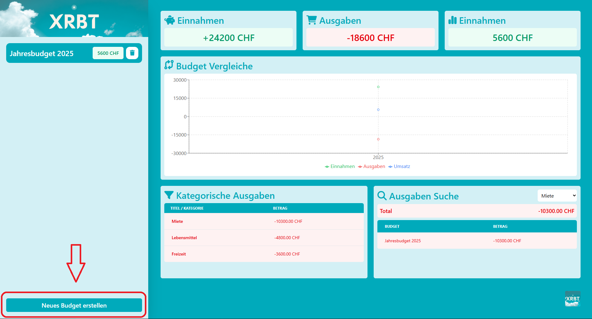

**Schritt 1**

Klicken Sie zu unterst auf der Navigationsleiste welche Links zu sehen ist auf den Button **"Neues Budget erstellen"**. Es sollte nach dem klick des Buttons ein PopUp erscheinen.

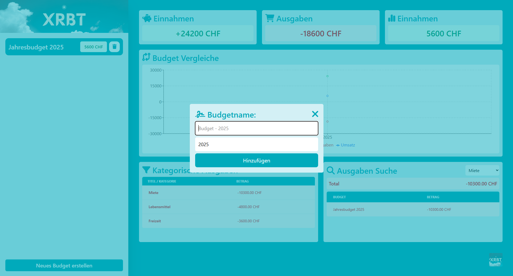

**Schritt 2**

Sie müssen im PopUp Fenster folgendes eingeben um nun ein neues Budget erstellen zu können:

- *Budgetname* (Zeichen und Nummern erlaubt)
- *Jahrgang* (Nur Nummern erlaubt)

Achten Sie darauf das Sie angemessene oder leichterkennbare Name benutzen, da Sie die Namen danach nicht mehr ändern können.

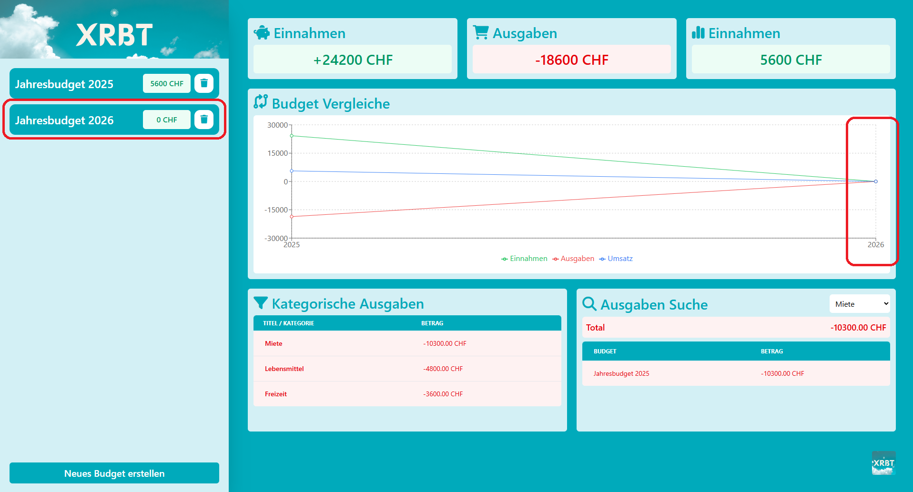

Sie sollten nun sehen auf der OverallView sehen, dass sich links in der Navigationsleiste ein neues Budget erstellt hat. Gleichzeitig haben Sie auf dem Liniendiagramm ein neuen Punkt gekriegt welche sich immer updated wenn Sie was nun im neu erstellten Budget ändern.

## Wie lösche ich ein Budget?
Fall Sie bemerken dass Sie einen falschen eingetippt haben, können Sie dies nicht mehr so leicht ändern. Falls Sie einen [Export](#wie-funktioniert-die-export-funktion) von dem Budget gemacht haben und das Budget nicht mehr brauchen können Sie einfach auf das Mülleimer Symbol klicken, danach wird das Budget mit allen Buchung automatisch gelöscht.

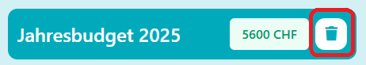

## Wie erstelle ich eine Buchung?
Falls Sie ein Budget erstellt haben und endlich die ersten Buchungen eingeben möchten, zeigen wir ihnnen hier wie einfach und schell dies geht! Fall Sie ein fertiges CSV haben und alles einfach direkt ins Budget importieren möchten können Sie dies schneller mit der [Import-Funktion](#wie-funktioniert-die-import-funktion) machen!

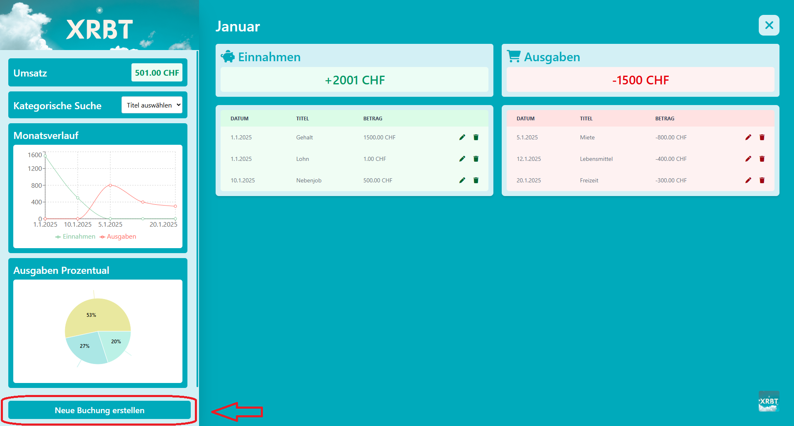

**Schritt 1**

Klicken Sie zu unterst auf der Navigationsleiste welche Links zu sehen ist auf den Button **"Neue Buchung erstellen"**. Es sollte nach dem klick des Buttons ein PopUp erscheinen.

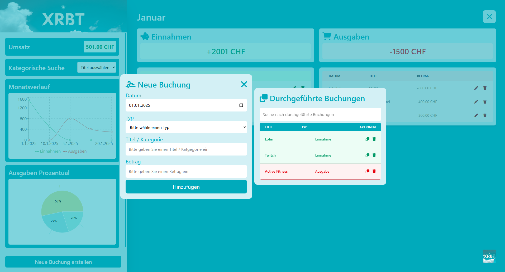

**Schritt 2**

Sie sehen nun 2 Fenster. Auf der linken Seite sehen Sie das Formular welche schlussendlich benutz wird, um die Buchung zu erstellen. Auf der rechten Seite sehen Sie alle Buchungen die Sie wiederholt durchgeführt haben.
- [Wenn Sie mehr über die rechte Seite erfahren möchten klicken Sie hier](#wie-speichere-ich-bestehende-buchungen-ab)

Um nun eine Buchung erfolgreich erstellen zu können müssen Sie folgende Felder ausfüllen:

- *Buchungsdatum* (Datum wann die Buchung durchgeführt wurde)
- *Typ* (Geben Sie an ob dies eine Einnahme oder Ausgabe war)
- *Titel* / Kategorie (Geben Sie einen passenden Titel der Buchung)
- *Betrag* (Geben Sie an wie hoch der Betrag war)

**Wichitg zu wissen**: Sie müssen sich auf dem *Betragfeld* nicht um **+** oder **-** scheren, dies wird direkt automatisch anhand des Types angepasst.

```
Einnahme:
- Plus -> Plus
- Minus -> Plus

Ausgabe:
- Plus -> Minus
- Minus -> Minus
```

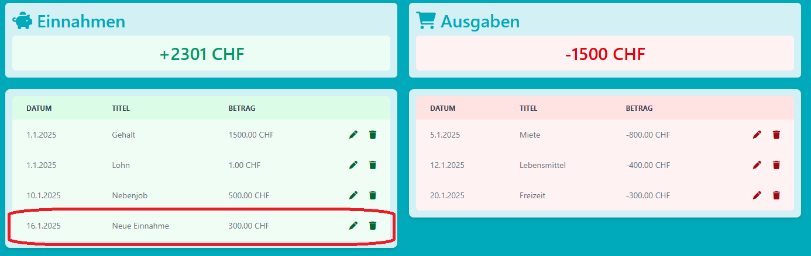

Sie sollten in der MonthView auf der Tabelle sehen das sich die Tabelle erweitert hat. Alle Buchung haben einen Einfluss auf die Statisiken überall auf der Applikation. Sie sehen auf der MonthView, sowie auf der Budget- & OverallView ihre Änderungen.

## Wie speichere ich bestehende Buchungen ab?
Wenn es ihnen zu anstrengend wird jedes mal die Buchung erneut einzugeben kann ihnen das PopUp **"Durchgeführte Buchungen"** helfen.

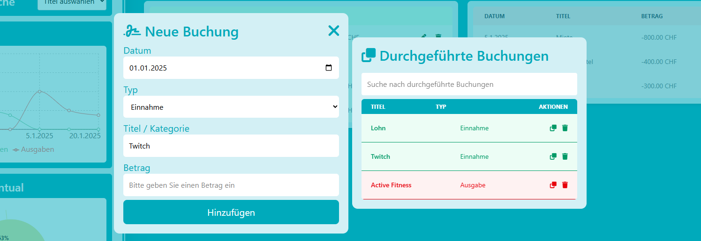

Sie sehen auf diesem PopUp alle Buchungen die Sie bisher mehrmals verwendet haben. Falls Sie auf anhieb ihre gewünschte Vorlage nicht gefunden haben, haben Sie immer noch die Möglichkeit danach zu suchen. Benutzen Sie dafür oberhalb der Tabelle die Suchfunktion.

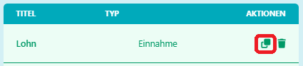

Haben Sie ihre Vorlage gefunden, klicken Sie rechts davon auf das Kopier Symbol. Es werden direkt Name und Typ ihnen vor ausgefüllt. Somit müssen Sie nur noch Datum eingeben.

## Wie bearbeite ich eine Buchung?
Sie können ganz einfach Buchung überarbeiten. Klicken Sie einfach auf der Tabelle auf der die Buchung ist auf das Bleistift Symbol. Danch wird sich wieder das PopUp öffen welches schon vor ausgefüllt ist, sodass sie ihre Änderung machen können ohne was Fehlerhaftes zu produzieren.

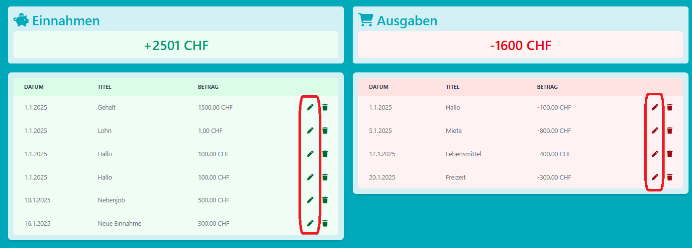

## Wie lösche ich eine Buchung?
Sie können ganz einfach Buchung löschen. Klicken Sie einfach auf der Tabelle auf der die Buchung ist auf das Mülleimer Symbol. Danch wird sich die Buchung ohne weiters gelöscht haben.

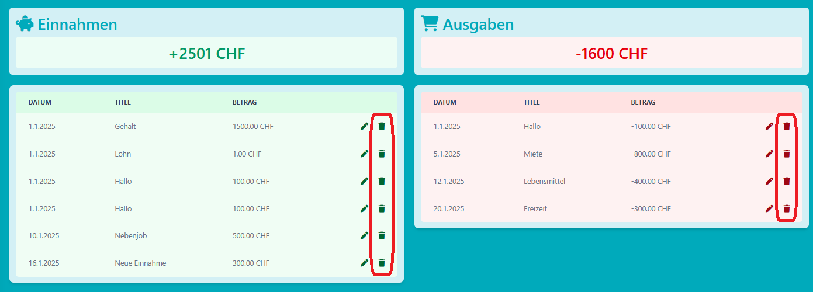

## Wann werden Backups erstellt?
Ein sehr wichtiges Thema für jeden der ein Budget führt. Grundsätzlich sind alle Benutzer welche die Applikation mit dem **Launcher** starten gesichert. Es werden **jede Stunde ein Backup** gemacht während das Programm läuft. Bei Schliessung des Programm wird auch ein extra backupgemacht sodass KEINE Änderungen verloren gehen. Ihre Backups können Sie alle im automatisch erstelltem Ordner `backup` sehen.

Für alle die Applikation auf anderem Wege starten gibt es kein Backup. Ihr habt Hauptsächlich das Volume von Docker, wenn ihr diese nicht löscht.

## Wie funktioniert die Import-Funktion?
Die Import-Funktion hilft ihnnen schneller ihr Budget zu erfassen! Um am besten mit dem Import durchstarten zu können empfehle ich ihnnen die [Export-Funktion](#wie-funktioniert-die-export-funktion) einmalig auszuführen um eine Vorlage zu kriegen.

***Der Importer akzeptiert nur CSV oder EXCEL***

Das Format der Daten sollte so aussehen:

| BuchungID | Monat     | Typ   | Titel        | Datum      | Betrag  |
|-----------|-----------|-------|--------------|------------|---------|
| 1         | Juni      | Einnahme | Gehalt       | 2025-06-25 | 2500.00 |
| 2         | Juni      | Ausgabe | Miete        | 2025-06-01 | -800.00 |
| 3         | Juni      | Ausgabe | Supermarkt   | 2025-06-15 | -150.75 |
| 4         | Juni      | Einnahme | Nebenjob     | 2025-06-20 | 400.00  |

- ***BuchungID*** (Für neue Buchugen dieses Feld leer lassen)
- *Monat* (Geben Sie den Monat Textlich ein)
- *Typ* (Geben Sie entweder Einnahme oder Ausgabe ein)
- *Titel* (Geben Sie einen passenden Titel)
- *Datum* (Geben Sie das Datum der Buchung ein)
- ***Betrag*** (Der Betrag wird automatisch umgewandelt in + oder - abhängig vom Typ)

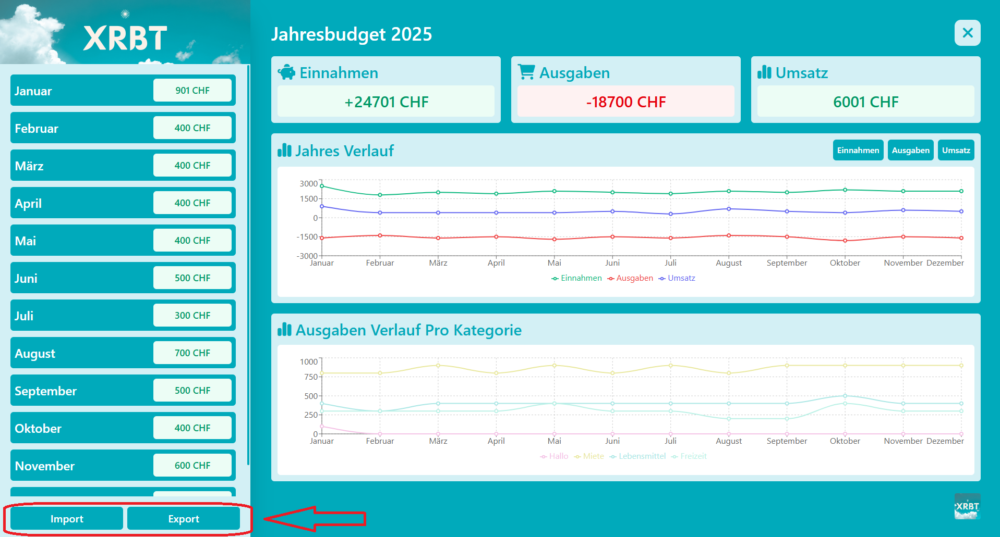

**Schritt 1**

Navigieren Sie zuerst auf ein Budget ihrer Wahl.

Danach klicken Sie zu unterst auf der Navigationsleiste welche Links zu sehen ist auf den Button **"Import"**. Es sollte nach dem klick des Buttons ein PopUp erscheinen.

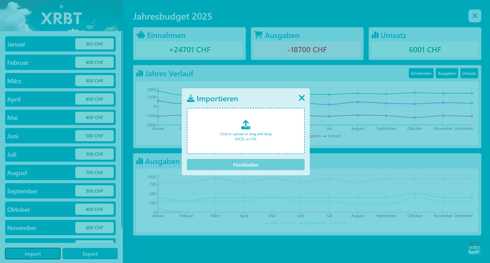

**Schritt 2**

Sie können nun auf diesem PopUp eine ***Excel*** oder ***CSV*** Datei hochladen. Danach prüft die Applikation die Daten und fügt Sie in die jeweilgen Monaten ein!

## Wie funktioniert die Export-Funktion?
Die Export-Funktion hilft ihnnen ihre Daten schnell für anderes benutzen zu können.


**Schritt 1**

Navigieren Sie zuerst auf ein Budget ihrer Wahl.

Danach klicken Sie zu unterst auf der Navigationsleiste welche Links zu sehen ist auf den Button **"Export"**. Es sollte nach dem klick des Buttons direkt ein Download passieren!

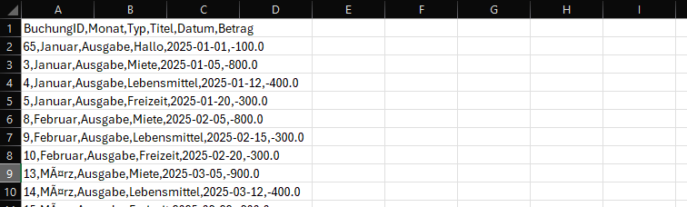

Sie werden ein CSV krigen welche das gleiche Format hat wie der Import. So können Sie auch einfach und schnell Massen änderungen machen.

## OverallView Statistiken
Die OverallView hat sehr schöne Statisitken, welche sehr nützlich sein könnten.

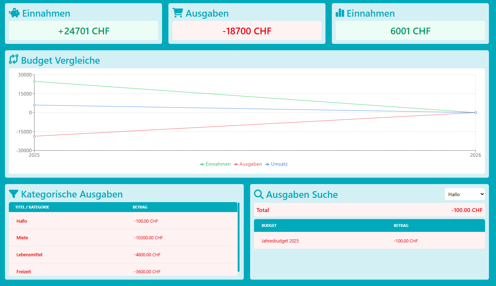

**Einnahmen**

Hier sehen Sie alle Einnahme von allen Budgets insgesamt!

**Ausgaben**

Hier sehen Sie alle Ausgaben von allen Budgets insgesamt!

**Umsatz**

Hier sehen Sie den Berechneten Umsatz von allen Einnahmen und Ausgaben.

**Budget Vergleiche**

Auf diesem Linen Diagramm sehen Sie alle Veränderungen der Budgets in den Jahren. Sie sehen darauf "Einnahmen", "Ausgaben" und den "Umsatz".

**Kategorische Ausgaben**

Dieses Tool ist sehr praktisch um zu sehen wie viel man von welcher Ausgaben am meisten hatte über Alle Budgets hinweg zusammen.

**Ausgaben Suche**

Benutzen Sie das Tool um heraus zu finden wie viel Sie in welcher Ausgabe hatten und sehen Sie auf der darunter stehen den Tabelle in welche Budget wie viel ausgeben wurde.

## BudgetView Statistiken
Auf dieser Statisik sehen Sie alles was Sie innerhalb dieses Budget eingegen haben, von Einnahmen bis zum ganzen Umsatz

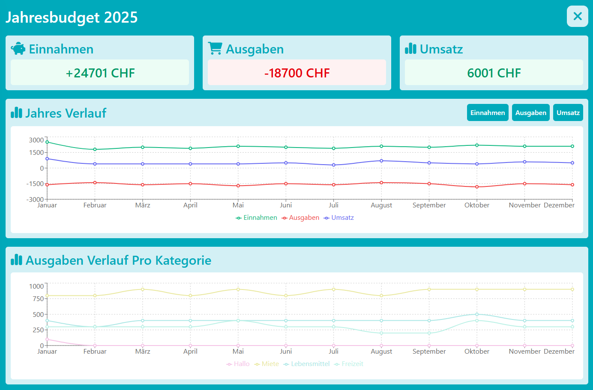

**Einnahmen**

Hier sehen Sie alle Einnahmen von diesem Budget insgesamt!

**Ausgaben**

Hier sehen Sie alle Ausgaben von diesem Budget insgesamt!

**Umsatz**

Hier sehen Sie den Berechneten Umsatz von allen Einnahmen und Ausgaben.

**Jahres Verlauf**

Auf diesem Lienendiagramm können Sie gut einsehen wie sich ihr Einnahmen, Ausgaben und Unsatz sich in diesem Jahr entwickelt hat.

**Ausgaben Verlauf Pro Kategorie**

Auf diesem Lienendiagramm können Sie alle Ausgaben einsehen und wie Sie sich im Jahr entwickelt haben. Es wird jede Ausgabe angezeigt. Jede Ausgabe mit dem gleichen namen wir zusammen addiert pro Monat.

## MonthView Statistiken

Sie sehen hier alles was innerhalb dieses Monats passiert ist. Sie können einsehen wie ihre Ausgaben und Einnahmen in diesem Monat entwickelt haben und sehen Prozentual wie sich die Ausgaben aufteilen.

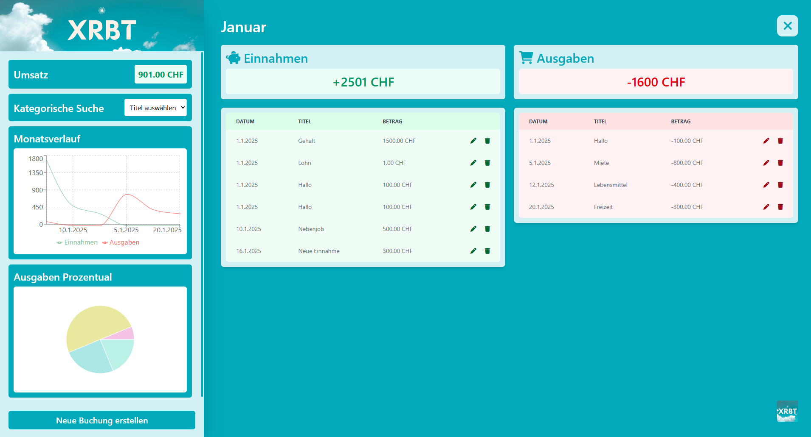

**Einnahmen**

Hier sehen Sie alle Einnahmen von diesem Monat insgesamt!

**Ausgaben**

Hier sehen Sie alle Ausgaben von diesem Monat insgesamt!

**Umsatz**

Hier sehen Sie den Berechneten Umsatz von allen Einnahmen und Ausgaben.

**Kategorische Suche**

Benutzen Sie das Tool um heraus zu finden wie viel Ausgaben Sie von dieser Kategorie in diesem Monat gemacht haben. 

**Monatsverlauf**

In diesem Liniendiagramm können Sie einsehen wie Sie sich mit den Einnahmen und Ausgaben entwickelt haben.

**Ausgaben Prozentual**

Mit diesem Kuchendiagramm sehen Sie Prozentual wie viel Sie von welcher Ausgabe gemacht haben.